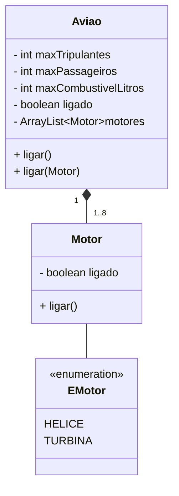

```mermaid
    classDiagram
        class Aviao{
            - int maxTripulantes
            - int maxPassageiros
            - int maxCombustivelLitros
            - boolean ligado
            - ArrayList~Motor~motores
            + ligar()
            + ligar(Motor)
        }
        
        class Motor{
            - boolean ligado
            + ligar()
        }
        
        class EMotor{
            <<enumeration>>
            HELICE
            TURBINA
        }
        
        Aviao "1" *-- "1..8" Motor
        Motor -- EMotor
```