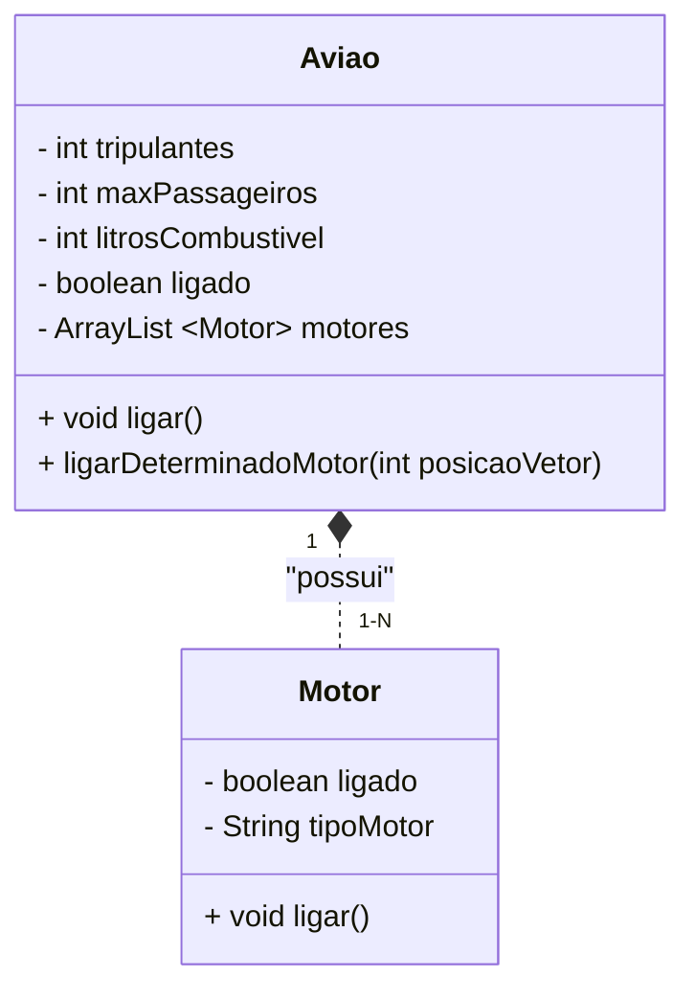

## Diagrama de classes UML

```mermaid  
    classDiagram
    %% Definição classes
    
        class Aviao{
            - int tripulantes
            - int maxPassageiros
            - int litrosCombustivel
            - boolean ligado
            - ArrayList ~Motor~ motores 
            + void ligar()
            + ligarDeterminadoMotor(int posicaoVetor)
        }
        
        class Motor{
            - boolean ligado
            - String tipoMotor
            + void ligar()
        }


    %% Associações e Relacionamentos
    Aviao "1" *.. "1-N" Motor : "possui"
    
```