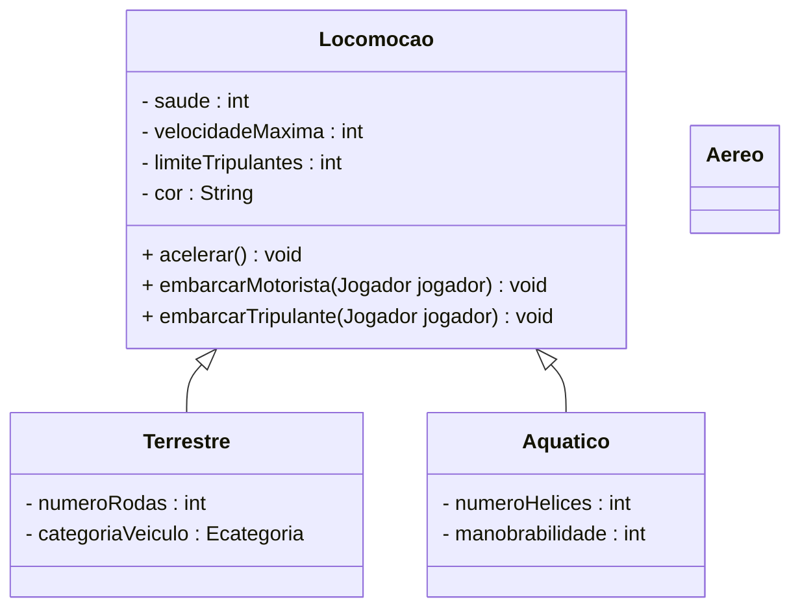

```mermaid
    classDiagram
        class Locomocao{
            - saude : int
            - velocidadeMaxima : int
            - limiteTripulantes : int
            - cor : String
            + acelerar() void
            + embarcarMotorista(Jogador jogador) void
            + embarcarTripulante(Jogador jogador) void
        }
        
        class Terrestre{
            - numeroRodas : int
            - categoriaVeiculo : Ecategoria
        }

        %%dificil justificar barco
        class Aquatico{
            - numeroHelices : int
            - manobrabilidade : int
        }
        %%dificil justificar 
        class Aereo{
            
        }
        
        Locomocao <| -- Terrestre
        Locomocao <| -- Aquatico
```