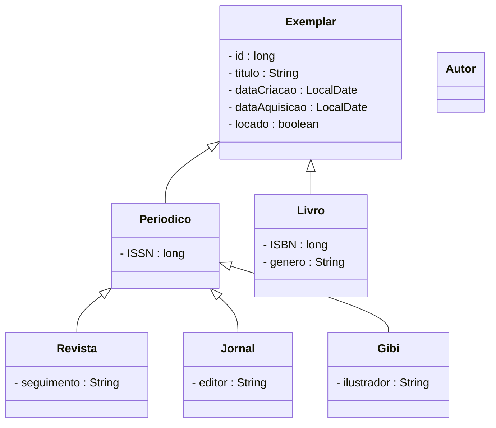

```mermaid
    classDiagram
        
        class Exemplar{
            - id : long
            - titulo : String
            - dataCriacao : LocalDate 
            - dataAquisicao : LocalDate
            - locado : boolean
        }
        
        class Autor {
            
        }
        
        class Periodico {
            - ISSN : long
        }
        
        class Livro{
            - ISBN : long
            - genero : String
        }
        
        class Revista{
            - seguimento : String
        }
        
        class Jornal{
            - editor : String
        }
        
        class Gibi{
            - ilustrador : String
     }
     
     Exemplar <| -- Livro
     Exemplar <| -- Periodico
     
     Periodico <|-- Revista
     Periodico <|-- Jornal
     Periodico <|-- Gibi
     
     
```