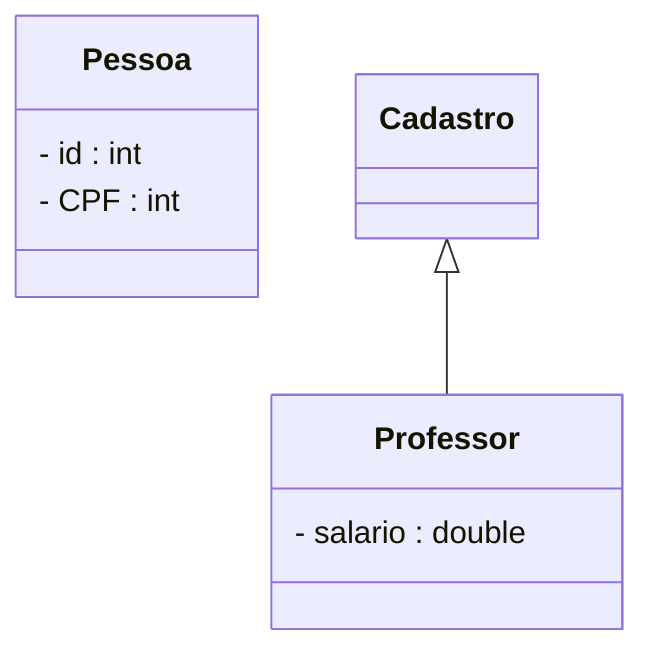

deve-se pensar em regras para o sistema academico fazer sentido

```mermaid
    classDiagram
        
        
        class Professor{
            - salario : double
        }
        
        class Pessoa{
            - id : int
            - CPF : int
        }
        
        
        Cadastro <| -- Professor
```