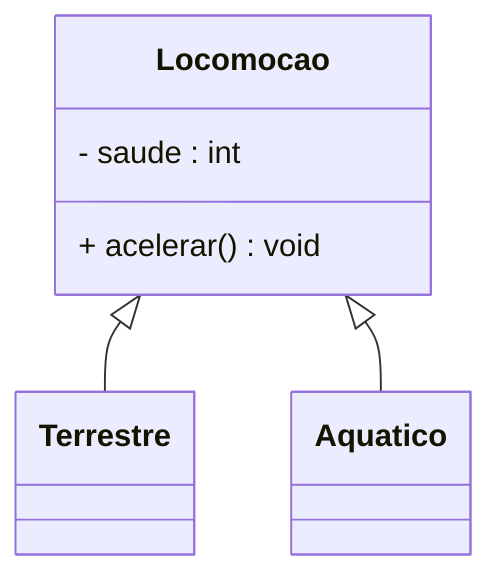

```mermaid
    classDiagram
        class Locomocao{
            - saude : int
            + acelerar() void
        }
        
        class Terrestre{
            
        }

        class Aquatico{

        }
        
        Locomocao <| -- Terrestre
        Locomocao <| -- Aquatico
```