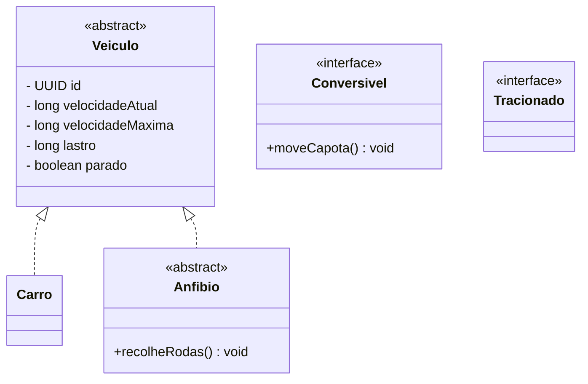

```mermaid
    classDiagram
%%    Anfibio <|.. Tracionado : implements
%%    Anfibio <|.. Conversivel : implements
%%    Carro <|.. Tracionado : implements
%%    Carro <|.. Conversivel : implements
%%    
    Veiculo <|.. Carro
    Veiculo <|.. Anfibio
    
        
        
        class Veiculo{
            <<abstract>>
            - UUID id
            - long velocidadeAtual
            - long velocidadeMaxima
            - long lastro
            - boolean parado
        }
        
        class Carro{
            
        }
        
        class Anfibio{
            <<abstract>>
            +recolheRodas()void
        }
        
        class Conversivel{
            <<interface>>
            +moveCapota()void
        }

        class Tracionado{
            <<interface>>
        }

```