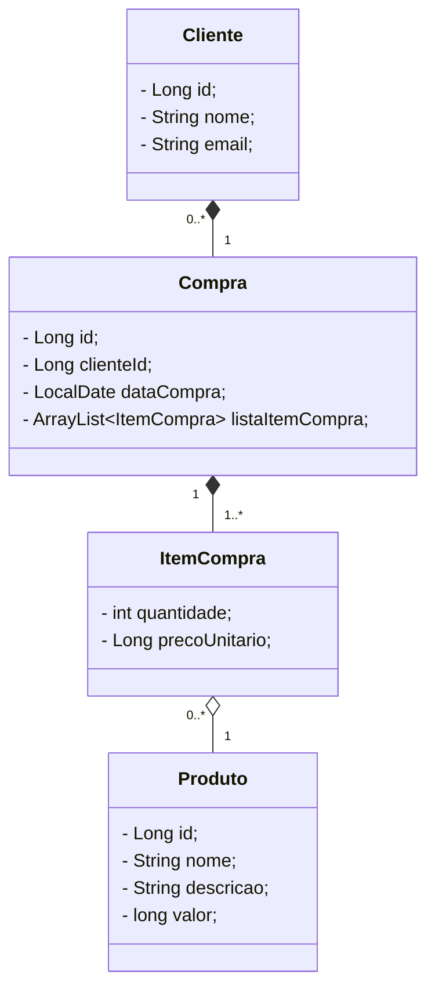

```mermaid
    classDiagram
        class Cliente{
            - Long id;
            - String nome;
            - String email;
            
        }
        
        class Compra{
            - Long id;
            - Long clienteId;
            - LocalDate dataCompra;
            - ArrayList~ItemCompra~ listaItemCompra;
        }
        
        class ItemCompra{
            - int quantidade;
            - Long precoUnitario;
        }
        
        class Produto{
            - Long id;
            - String nome;
            - String descricao;
            - long valor;
        }
        
        Cliente "0..*" *-- "1" Compra
        Compra "1" *-- "1..*"ItemCompra
        ItemCompra "0..*" o-- "1" Produto

```